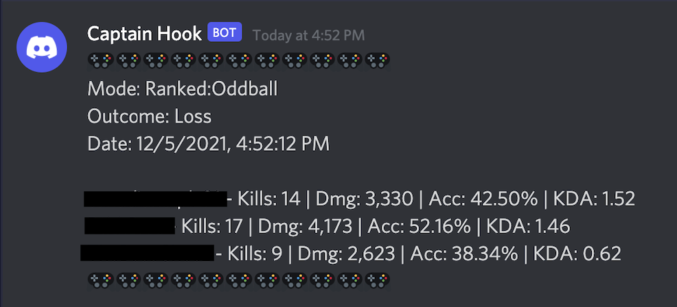

# Halo Infinite Discord

This is a simple app that will allow you to show basic Halo Infinite match stats in Discord after a match has finished. Here's what it will look like in your Discord:
 

## Installation
1. First, create a new Google Sheet (https://sheets.google.com/).
2. In that sheet, click on Extensions > AppScript.
3. Once the AppsScript editor opens, copy and paste the entire Code.js in this repository and paste it into the editor. You can remove the myFuntion script that is placed by default.
4. Open up Discord and pick the channel you want to display these stats in. I recommend creating a new channel so that it doesn't flood your other channels. We've named ours "halo-stats". I recommend originally making this a private channel. When you first run the integration, a lot of previous matches will be flooded in. After you've done that, your Google Spreadsheet will keep track of matches that have already been sent to Discord and you'll only get new matches. After the initial run, you can set it as a public channel so everyone can view it.
5. Right click the channel and hit "Edit Channel". Go to "Integrations" and click "Create Webhook". Hit "Copy Webhook URL".
6. In the AppsScript Editor, paste the webhook url as a string into the productionUrl variable. If you want to do testing in a different channel, you can also set a testingUrl and set testing=true. 
7. The humanObj variable is where you select the players you want to track. Replace the information in there with the players username and platform. The easiest way to find this info is to find them on https://halotracker.com/. The URL will contain the username and the platform (note: this is case sensitive). You can add as many users as you'd like into the array by copy and pasting the object that already exists. Be sure to remove the sample objects completely.
8. Save the AppsScript and then hit "Run" at the top. When asked for permissions, you'll be told that it isn't verified. You can hit "Advanced" and then "Go to Untitled (unsafe)". You're welcome to check the code to ensure there isn't anything fishy going on.
9. You may have to run again after allowing permissions, but then. You should see data start to flow into Discord. It may pull in some past matches.
10. To get this to run periodically, in AppScript, go to "Triggers" on the left hand menu, and click "Add Trigger". Where it says "Select event-source" choose "time driven", and then you can select the frequency at which this runs. We don't play a ton, so I have it run every minute, but you may run into API limits if your frequency is high.

### This app was developed as a fun project and is no way affiliated with Halo, Microsoft, 343 Industries, HaloTracker.gg or any other entity other than myself. Use at your own risk!